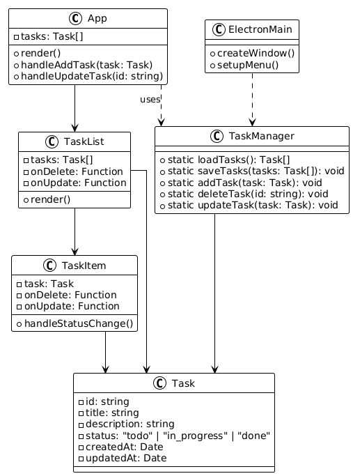
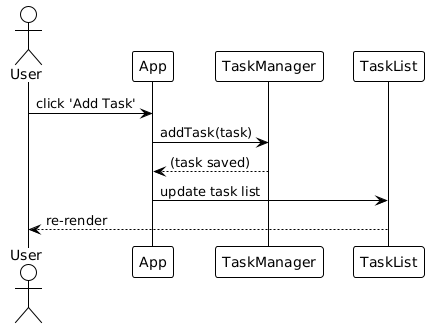
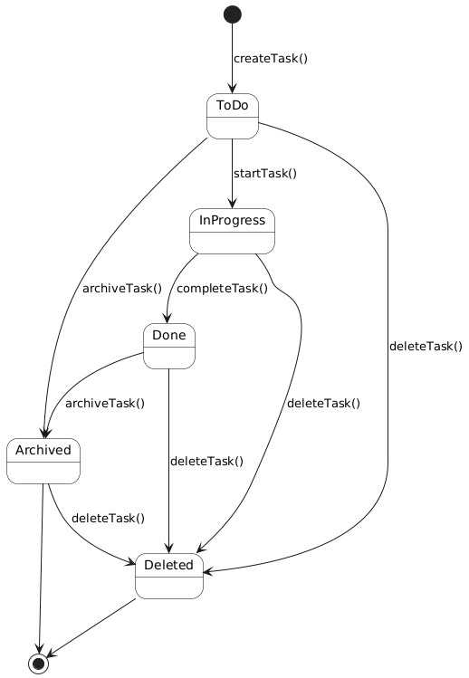
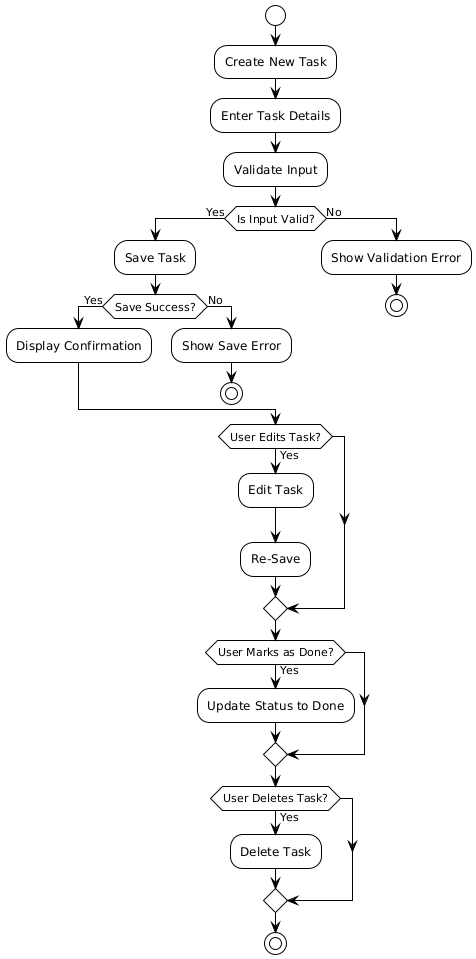

# YatPotato - React Electron 桌面应用

这是一个使用 React 和 Electron 构建的桌面应用程序项目。

## 项目技术栈

- **前端框架**: React 19.1.0
- **桌面应用框架**: Electron 36.3.2
- **构建工具**: React Scripts 5.0.1
- **开发环境**: Node.js + npm
- **主要依赖**:
  - `@testing-library/react` ^16.3.0 - React 测试工具
  - `node-fetch` ^2.7.0 - HTTP 请求库
  - `ws` ^8.18.2 - WebSocket 库
- **开发依赖**:
  - `concurrently` ^8.2.0 - 并发运行脚本
  - `electron-builder` ^24.13.3 - Electron 打包工具
  - `wait-on` ^7.0.1 - 等待服务启动工具

## 核心功能特性

### 🍅 番茄钟工作法
- **标准番茄钟**: 25分钟专注 + 5分钟休息
- **长休息**: 每4个番茄钟后15分钟长休息
- **自定义时长**: 支持1-90分钟自定义专: 专注时间和休息时间自动切换
系统
- **开始音效**: 专注开始时播放上升音调提示
- **结束音效**: 时间到时播放三声和弦提示
- **倒计时音效**: 最后10秒播放滴答声
- **基于Web Audio API**: 纯JavaScript生成音效，无需外部音频文件

### 📊 数据统计与成就
- **实时统计**: 今日完成番茄钟数量、总专注时长
- **进度显示**: 可视化进度圆环和百分比
- **成就系统**: 基于完成数据的动态成就解锁
- **数据持久化**: 自动保存用户数据和统计信息

### 🖥️ 桌面应用特性
- **跨平台**: 支持Windows、macOS、Linux
- **原生体验**: Electron桌面应用，支持系统通知
- **离线使用**: 无需网络连接，数据本地存储
- **热重载**: 开发环境支持代码热重载

### 🎨 用户界面
- **现代UI**: 渐变背景、动画效果、响应式设计
- **主题切换**: 多种视觉主题和配色方案
- **移动适配**: 响应式布局，支持不同屏幕尺寸
- **交互反馈**: 丰富的视觉反馈和动画效果

## 项目结构

```
YatPotato-main/
├── src/                    # React 应用源代码
│   ├── components/         # React 组件
│   │   ├── PomodoroTimer.js       # 番茄钟计时器组件
│   │   ├── DataStorageDemo.js     # 数据存储演示组件
│   │   ├── PomodoroTimer/         # 番茄钟组件模块
│   │   │   └── index.js
│   │   └── DataStorageDemo/       # 数据存储演示模块
│   │       └── index.js
│   ├── utils/             # 工具函数
│   │   ├── stringRef.js           # 字符串引用工具
│   │   ├── environment.js         # 环境检测工具
│   │   ├── audioManager.js        # 音频管理工具
│   │   ├── string/               # 字符串工具模块
│   │   ├── env/                  # 环境工具模块
│   │   └── audio/                # 音频工具模块
│   ├── constants/         # 常量定义
│   │   ├── strings.js            # 字符串常量
│   │   └── timer.js              # 计时器常量
│   ├── src/              # 嵌套源代码结构(历史版本)
│   │   ├── hooks/                # React Hooks
│   │   │   └── usePomodoroTimer.js
│   │   ├── components/           # 组件模块
│   │   ├── utils/               # 工具模块
│   │   └── constants/           # 常量模块
│   ├── App.js            # 主应用组件
│   ├── App.css           # 主应用样式
│   ├── index.js          # React 入口
│   └── index.css         # 全局样式
├── public/               # 静态资源和 Electron 配置
│   ├── electron.js       # Electron 主进程
│   ├── preload.js        # 预加载脚本
│   ├── index.html        # HTML 模板
│   ├── favicon.ico       # 网站图标
│   ├── logo192.png       # 应用图标 (192x192)
│   ├── logo512.png       # 应用图标 (512x512)
│   ├── manifest.json     # Web 应用清单
│   └── robots.txt        # 搜索引擎爬虫规则
├── scripts/              # 构建脚本
│   └── dev.js            # 开发环境脚本
├── data/                 # 数据存储目录
│   └── ds-test/          # 测试数据存储
│       └── user1/        # 用户数据目录
│           └── tasks.json
├── .cursor/              # Cursor AI 规则配置
│   └── rules/            # 开发规则文件
│       ├── project-overview.mdc         # 项目概览规则
│       ├── react-development.mdc        # React 开发规则
│       ├── electron-development.mdc     # Electron 开发规则
│       ├── coding-standards.mdc         # 代码规范标准
│       ├── development-workflow.mdc     # 开发工作流程
│       ├── change-tracking.mdc          # 变更跟踪规则
│       └── auto-git-commit.mdc          # 自动Git提交规则
├── docs.md               # 文档说明
├── package.json          # 项目配置和依赖
├── README.md             # 项目说明文档
└── *.png                 # UML 图表文件
    ├── 类.png            # 类图
    ├── 顺序.png          # 顺序图
    ├── 状态.png          # 状态图
    └── 活动.png          # 活动图
```

## 快速开始

### 环境要求
- Node.js (推荐版本 16.0+)
- npm 或 yarn 包管理器

### 安装依赖
```bash
npm install
```

### 开发模式运行
```bash
# 启动 Electron 开发环境（推荐）
npm run electron-dev

# 或者仅启动 React 开发服务器
npm start
```

### 构建和打包
```bash
# 构建生产版本
npm run build

# 打包为桌面应用
npm run dist
```

## 项目架构

### 主要组件
- **App.js**: 主应用组件，管理全局状态和路由
- **PomodoroTimer.js**: 番茄钟计时器核心组件
- **DataStorageDemo.js**: 数据存储演示组件

### 工具模块
- **environment.js**: 环境检测（Electron vs 浏览器）
- **audioManager.js**: 音频管理和音效生成
- **stringRef.js**: 字符串引用和国际化支持

### 数据存储
- **本地存储**: 使用 Electron 的文件系统API
- **跨平台**: 支持不同操作系统的数据目录
- **数据结构**: JSON 格式存储用户设置和统计数据

## 开发规范

项目使用 `.cursor/rules/` 目录下的规则文件来规范开发流程：

- **项目概览**: 项目架构和目录结构说明
- **React 开发**: 组件开发约定和状态管理
- **Electron 开发**: 桌面应用开发最佳实践
- **代码规范**: 代码风格和命名约定
- **开发工作流**: 开发流程和部署指南
- **变更跟踪**: 代码变更记录和版本管理

## 开发命令

### 标准 React 命令

#### `npm start`
在开发模式下运行应用。
在浏览器中打开 [http://localhost:3000](http://localhost:3000) 查看。

当你修改代码时，页面会自动重新加载。
你也可以在控制台中看到任何 lint 错误。

#### `npm test`
在交互式监视模式下启动测试运行器。
查看关于[运行测试](https://facebook.github.io/create-react-app/docs/running-tests)的更多信息。

#### `npm run build`
将应用构建到 `build` 文件夹中用于生产环境。
它会在生产模式下正确打包 React 并优化构建以获得最佳性能。

构建是压缩的，文件名包含哈希值。
你的应用已准备好部署！

### Electron 专用命令

#### `npm run electron-dev`
**推荐开发命令** - 并发启动 React 开发服务器和 Electron 应用，支持热重载。
这是开发时的主要命令，会自动等待 React 服务器启动后再启动 Electron。

#### `npm run electron-build`
先构建 React 应用，然后启动 Electron 应用。
适用于测试生产构建版本。

#### `npm run electron-pack`
构建并打包 Electron 应用，但不创建安装包。
用于测试打包流程。

#### `npm run dist`
构建并打包 Electron 应用为可分发的安装包。
会在 `dist` 目录中生成各平台的安装文件。

#### `npm run dev`
使用自定义开发脚本启动应用。
提供更多开发环境配置选项。

### 其他命令

#### `npm run eject`
**注意：这是一个单向操作。一旦你 `eject`，就不能回退！**

如果你对构建工具和配置选择不满意，可以随时执行 `eject`。此命令会从你的项目中移除单个构建依赖。

它会将所有配置文件和传递依赖项（webpack、Babel、ESLint 等）复制到你的项目中，这样你就可以完全控制它们。除了 `eject` 之外的所有命令仍然可以工作，但它们会指向复制的脚本，这样你就可以调整它们。在这一点上，你就只能靠自己了。

你不需要使用 `eject`。精选的功能集适合中小型部署，你不应该觉得有义务使用这个功能。但我们理解，如果你在准备好时不能自定义这个工具，那它就不会有用。

## UML 设计图表

### 类图



展示了应用的主要类结构和它们之间的关系，包括：

- **App**: 主应用类，管理全局状态
- **PomodoroTimer**: 番茄钟计时器类
- **DataStorage**: 数据存储管理类
- **TaskManager**: 任务管理类

### 顺序图 - 用户添加任务交互流程



**参与者**：用户、应用（App）、任务管理器（TaskManager）、任务列表（TaskList）

**流程描述**：

1. 用户点击"添加任务"按钮
2. 应用接收到用户请求，调用任务管理器的 `addTask(task)` 方法
3. 任务管理器保存任务，并返回任务保存成功的确认信息
4. 应用接收到任务保存成功的消息后，更新任务列表
5. 最后，应用重新渲染界面，展示最新的任务列表给用户

### 状态图 - 任务状态转换



**状态**：待办（ToDo）、进行中（InProgress）、已完成（Done）、已归档（Archived）、已删除（Deleted）

**状态转换**：

- 任务从"待办"状态开始，可以通过 `startTask()` 方法转换为"进行中"状态
- "进行中"的任务可以通过 `completeTask()` 方法变为"已完成"，也可以通过 `archiveTask()` 方法变为"已归档"
- "已完成"和"已归档"的任务都可以通过 `deleteTask()` 方法被删除，进入"已删除"状态

### 活动图 - 任务管理流程



**流程描述**：

- **创建任务**：用户创建新任务，输入任务详情，系统验证输入。如果输入有效，保存任务并显示保存成功的确认信息；如果无效，显示验证错误信息
- **编辑任务**：用户可以选择编辑已存在的任务，修改后重新保存
- **标记完成**：用户可以将任务标记为已完成，系统更新任务状态
- **删除任务**：用户可以选择删除任务，系统执行删除操作

## 变更日志

### 2024-12-19 - AI助手变更记录 (Bug修复更新)

#### 修复问题

- `src/components/PomodoroTimer.js` - 
  - 🐛 **修复计时器状态不同步问题**: 重构计时器逻辑，使用totalSeconds统一管理时间状态
  - 🔧 **解决23:59跳跃问题**: 避免在setSeconds回调中同时调用setMinutes导致的状态更新不同步
  - ⚡ **优化性能**: 使用单一状态源管理时间，减少状态更新复杂度
  - 🎯 **精确计时**: 现在计时器从设定时间准确倒计时，不会出现时间跳跃
  - ✅ **测试结果**: 
    - 25分钟计时器从25:00准确倒计时到00:00
    - 1分钟计时器从01:00准确倒计时到00:00  
    - 2分钟计时器从02:00准确倒计时到00:00
    - 不再出现24:59或23:59的时间跳跃

#### 技术重构详情

- **核心改变**: 

  - 移除单独的minutes和seconds状态变量
  - 新增totalSeconds作为唯一时间状态源
  - 通过计算属性获取分钟和秒钟显示值

- **计算逻辑**:

  ```javascript
  const minutes = Math.floor(totalSeconds / 60);
  const seconds = totalSeconds % 60;
  ```

- **计时逻辑**: 每秒减少totalSeconds，避免多状态同步问题

- **进度计算**: 基于totalSeconds重新计算进度百分比

#### 解决的根本问题

- **状态同步问题**: React中多个相关状态同时更新可能不同步
- **时间跳跃**: setSeconds和setMinutes在同一个更新周期中可能产生竞态条件
- **计算错误**: 分别管理分钟和秒钟容易出现边界条件错误

---

- `src/App.css` - 
  - 🎨 **修复登录界面布局问题**: 将login-container-desktop的height改为min-height: 680px
  - 📐 **改进白色区域覆盖**: 确保"注册一个新的吧！"按钮完全显示在白色背景区域内
  - 💡 **用户体验提升**: 登录界面现在有足够的空间容纳所有UI元素

#### 技术细节

- **计时器问题根因**: React状态管理中，同时更新多个相关状态会导致同步问题和竞态条件
- **解决方案**: 使用单一状态源(totalSeconds)管理时间，通过计算属性派生显示值
- **布局问题根因**: 固定高度620px不足以容纳所有登录界面元素
- **解决方案**: 改用min-height: 680px，允许容器根据内容自适应高度

---

### 2024-12-19 - AI助手变更记录

#### 新增文件

- `.cursor/rules/project-overview.mdc` - 项目概览规则，描述项目架构、目录结构和主要入口点
- `.cursor/rules/react-development.mdc` - React 开发规则，包含组件开发约定、状态管理和测试规范
- `.cursor/rules/electron-development.mdc` - Electron 开发规则，涵盖架构、IPC通信、安全实践和打包指南
- `.cursor/rules/coding-standards.mdc` - 代码规范标准，定义代码风格、命名约定、依赖管理和性能优化准则
- `.cursor/rules/development-workflow.mdc` - 开发工作流程规则，包含项目设置、开发流程、构建部署和调试指南
- `.cursor/rules/change-tracking.mdc` - 变更跟踪规则，要求AI助手在每次代码修改后记录变更日志
- `src/components/PomodoroTimer.js` - 完整的番茄钟组件，实现以下功能：
  - 🔊 **音效系统**: 使用Web Audio API生成开始音效、结束音效和倒计时滴答声
  - ⏰ **完整倒计时**: 精确的分钟秒钟倒计时逻辑
  - 🍅 **番茄工作法**: 25分钟专注 + 5分钟休息，第4个番茄钟后15分钟长休息
  - 📊 **进度跟踪**: 实时计算和显示进度百分比
  - 🔔 **桌面通知**: 支持浏览器原生通知API
  - 🎯 **阶段管理**: 自动在专注时间和休息时间之间切换

#### 修改文件

- `src/App.js` - 
  - 集成新的PomodoroTimer组件，替换原有简单计时器逻辑
  - 添加番茄钟统计数据管理(总番茄数、今日番茄数、总专注时长)
  - 新增视觉增强功能：
    - 🎨 进度圆环显示计时进度
    - 🏷️ 当前阶段指示器(专注/休息)
    - 📈 实时统计信息显示
    - ⏭️ 跳过当前阶段按钮
  - 改进用户界面交互和反馈
  - 更新成就系统以基于实际番茄钟完成数据
  - 优化锁定屏幕显示当前阶段信息

- `src/App.css` - 
  - 添加番茄钟专用样式：进度圆环、阶段指示器、统计卡片
  - 美化控制按钮：渐变背景、悬停效果、禁用状态
  - 新增成就解锁动画效果
  - 增强设置面板视觉设计
  - 改进响应式设计支持移动设备
  - 添加激励语句样式美化

- `README.md` - 
  - 添加了项目说明和技术栈介绍
  - 重新组织了项目结构说明
  - 新增了Electron专用命令说明
  - 创建了变更日志部分用于跟踪所有代码变更

#### 功能特性总结

🎵 **音效系统**:

- 开始专注时播放上升音调提示音
- 结束时播放三声和弦提示音  
- 最后10秒播放滴答倒计时音

⏱️ **计时功能**:

- 精确的分钟+秒钟倒计时
- 可视化进度圆环
- 自定义专注时长(1-90分钟)

🍅 **番茄工作法**:

- 标准25分钟专注 + 5分钟休息
- 每4个番茄钟后15分钟长休息
- 自动阶段切换和提醒

📊 **数据统计**:

- 今日完成番茄钟数量
- 总专注时长统计
- 持久化数据存储

🏆 **成就系统**:

- 基于实际数据的动态成就解锁
- 发光动画效果
- 激励用户持续使用

## 了解更多

你可以在 [Create React App 文档](https://facebook.github.io/create-react-app/docs/getting-started) 中了解更多信息。

要学习 React，请查看 [React 文档](https://reactjs.org/)。

### 代码分割
本节已移至：[代码分割](https://facebook.github.io/create-react-app/docs/code-splitting)

### 分析包大小
本节已移至：[分析包大小](https://facebook.github.io/create-react-app/docs/analyzing-the-bundle-size)

### 制作渐进式Web应用
本节已移至：[制作渐进式Web应用](https://facebook.github.io/create-react-app/docs/making-a-progressive-web-app)

### 高级配置
本节已移至：[高级配置](https://facebook.github.io/create-react-app/docs/advanced-configuration)

### 部署
本节已移至：[部署](https://facebook.github.io/create-react-app/docs/deployment)

### 构建失败排查
本节已移至：[构建失败排查](https://facebook.github.io/create-react-app/docs/troubleshooting#npm-run-build-fails-to-minify)

- 

## 贡献指南

欢迎贡献代码！请遵循以下步骤：

1. **Fork 项目**
2. **创建功能分支** (`git checkout -b feature/AmazingFeature`)
3. **提交更改** (`git commit -m 'Add some AmazingFeature'`)
4. **推送到分支** (`git push origin feature/AmazingFeature`)
5. **创建 Pull Request**

### 开发注意事项
- 遵循项目的代码规范 (参见 `.cursor/rules/`)
- 编写清晰的提交信息
- 添加必要的测试用例
- 更新相关文档

## 许可证

本项目使用 MIT 许可证。查看 [LICENSE](LICENSE) 文件了解更多信息。

## 联系方式

- 项目链接：[YatPotato](https://github.com/yourusername/YatPotato)
- 问题报告：[Issues](https://github.com/yourusername/YatPotato/issues)

---
