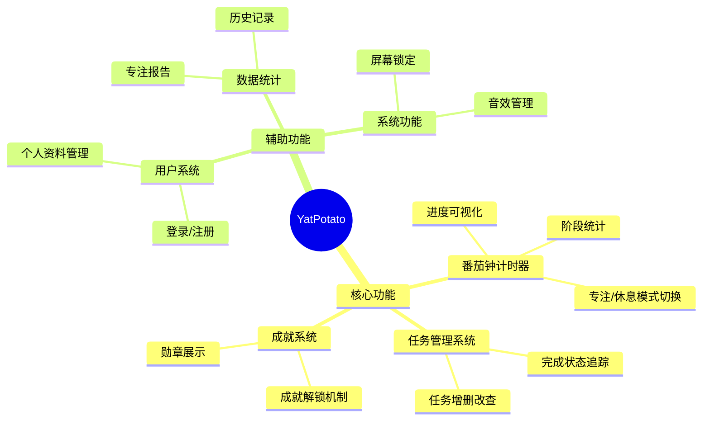
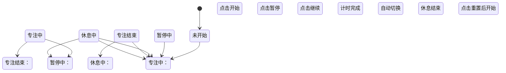
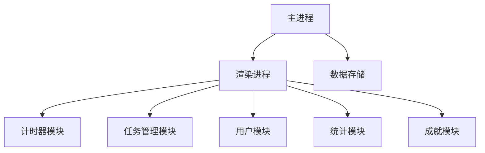

<!-- 文档元信息区 -->
> **文档类型**：功能需求文档 (FRD)  
> **模块名称**：YatPotato 番茄工作法应用  
> **版本号**：v1.3  
> **起草人**：AI助手@开发组  
> **审核人**：[审核人员姓名]@测试组  
> **最后更新**：2025-04-20  
> **关联Commit**：gitlab/yatpotato@e4f5g6h7  
> **文档状态**：`✅正式发布`

---

## 1. 变更记录

| 版本 | 日期       | 修改人 | 变更描述                 | 审核状态 |
|------|------------|--------|--------------------------|----------|
| v1.0 | 2025-04-15 | AI助手 | 初稿创建                 | ✅        |
| v1.1 | 2025-04-17 | AI助手 | 添加计时器详细规格       | ✅        |
| v1.2 | 2025-04-18 | AI助手 | 补充任务管理和用户系统   | ✅        |
| v1.3 | 2025-04-20 | AI助手 | 添加音效与通知规格       | ✅        |

---

## 2. 功能概述

### 2.1 功能范围



### 2.2 用户故事

```markdown
- **角色**：效率追求者
- **需求**：作为用户，我希望能通过直观的计时器管理工作时间
- **验收条件**：
  1. 可以设置25分钟专注时间
  2. 自动切换5分钟休息时间
  3. 每4个番茄钟后进入15分钟长休息

- **角色**：任务管理者
- **需求**：作为用户，我希望能管理每日任务清单
- **验收条件**：
  1. 可添加新任务并设置标题
  2. 可标记任务为完成状态
  3. 可删除不需要的任务

- **角色**：数据驱动型用户
- **需求**：作为用户，我希望查看专注统计数据
- **验收条件**：
  1. 显示今日完成番茄钟数量
  2. 显示总专注时长
  3. 显示累计打卡天数
```

---

## 3. 详细规格

### 3.1 番茄钟计时器

| 功能项         | 详细规格                                                                 |
|----------------|--------------------------------------------------------------------------|
| 时间控制       | 默认25分钟专注/5分钟休息，可自定义时长(1-90分钟)                         |
| 状态指示       | 视觉区分专注(红色)/休息(绿色)状态                                        |
| 进度可视化     | 环形进度条显示剩余时间比例                                               |
| 阶段计数       | 显示当前是第几个番茄钟，每4个一轮回                                      |
| 控制功能       | 开始/暂停/重置/跳过当前阶段                                              |

### 3.2 任务管理系统

| 字段/功能      | 规格                                                                     |
|----------------|--------------------------------------------------------------------------|
| 任务结构       | {id, title, completed, isDelete}                                        |
| 添加任务       | 通过输入框添加，回车确认                                                 |
| 编辑任务       | 点击任务标题进入编辑模式                                                 |
| 完成任务       | 点击圆形图标切换完成状态                                                 |
| 删除任务       | 软删除（标记isDelete）                                                   |
| 任务持久化     | 使用DataStorage保存到本地                                                |

### 3.3 成就系统

| 成就名称       | 解锁条件                                 | 勋章图标 |
|----------------|------------------------------------------|----------|
| 初学者         | 完成第一个番茄钟                         | 🔥       |
| 高效达人       | 一天内完成5个番茄钟                      | ⚡       |
| 持之以恒       | 连续7天使用                              | 🏆       |
| 番茄大师       | 完成20个番茄钟                           | 🌟       |
| 专注王者       | 累计专注100小时                          | 💎       |

### 3.4 状态机逻辑（计时器）



### 3.5 用户系统

| 功能         | 详细规格                                                                 |
|--------------|--------------------------------------------------------------------------|
| 登录         | 用户名+密码验证，自动聚焦优化                                            |
| 注册         | 用户名(≥3字符)+邮箱(格式验证)+密码(≥6字符)+确认密码                     |
| 表单验证     | 实时显示错误提示                                                         |
| 个人资料     | 可编辑个性签名(≤50字符)                                                  |
| 数据隔离     | 使用用户专属存储空间                                                     |

### 3.6 音效与通知

| 触发时机       | 反馈机制                                                                 |
|----------------|--------------------------------------------------------------------------|
| 计时开始       | 播放上升音调提示音                                                        |
| 计时结束       | 播放三声和弦音效 + 桌面通知                                                |
| 最后10秒       | 每秒滴答声提醒                                                            |
| 成就解锁       | 特殊音效 + 视觉动效                                                       |

### 3.7 数据统计

| 指标         | 计算方式                                                                 |
|--------------|--------------------------------------------------------------------------|
| 今日番茄数   | 当天完成的番茄钟总数                                                     |
| 总专注时长   | 所有番茄钟时长累计(分钟)                                                  |
| 打卡天数     | 有番茄钟完成记录的天数                                                   |
| 连续打卡     | 有番茄钟记录的最大连续天数                                               |

---

## 4. 接口规范

### 4.1 数据存储接口

```javascript
// 数据存储结构
{
  // 任务数据
  "tasks": [
    {
      "id": 1713598800000,
      "title": "完成需求文档",
      "completed": false,
      "isDelete": false
    }
  ],
  
  // 番茄统计数据
  "pomodoro_stats": {
    "totalPomodoros": 12,
    "todayPomodoros": 3,
    "totalFocusTime": 300,
    "Pomodoros": ["2025-04-18", "2025-04-19", "2025-04-20"]
  },
  
  // 用户数据
  "user_signature": "今天也是专注的一天！"
}

// 数据访问API
dataStorage.loadDataStorage("storage_name") // 初始化存储
dataStorage.save("key", data)              // 保存数据
dataStorage.load("key")                    // 加载数据
dataStorage.registerUpdateEventWithKey()   // 注册数据更新监听
```

### 4.2 计时器组件接口

```javascript
PomodoroTimer({
  initialMinutes: 25,             // 初始分钟数
  onTimerStart: (isBreak) => {},  // 计时开始回调
  onTimerComplete: (isBreak, count) => {}, // 计时完成回调
  onTimerReset: () => {},         // 重置回调
  onTimerStateChange: (isRunning, min, sec) => {} // 状态变化
})
```

---

## 5. 技术架构

### 5.1 系统架构图



### 5.2 技术栈

| 领域         | 技术选型                                                                 |
|--------------|--------------------------------------------------------------------------|
| 前端框架     | React 19.1                                                               |
| 桌面运行时   | Electron 36                                                              |
| 状态管理     | React Hooks(useState, useRef, useMemo)                                  |
| 数据持久化   | 自定义DataStorage模块                                                    |
| 构建工具     | React Scripts 5.0                                                        |

---

## 6. 附录

### 6.1 相关文档

- [SAD-YatPotato系统架构设计_v1.2.md]
- [API-计时器组件规范_v2.1.md]
- [UXD-用户界面设计规范_v3.0.md]

### 6.2 待办事项

- [ ] 实现专注趋势图表可视化
- [ ] 添加社交分享功能
- [x] 完成屏幕锁定功能
- [x] 实现音效反馈系统
- [ ] 开发多语言支持
- [ ] 增加云同步功能

### 6.3 已知问题

1. 移动端适配仍需优化（特别是小屏幕设备）
2. 成就解锁检查存在边界条件问题
3. 初次加载时数据初始化可能出现延迟
4. 连续打卡统计需要完善时区处理